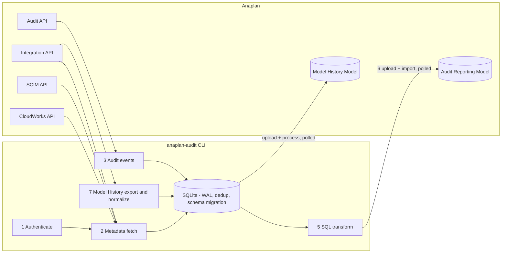

# Anaplan Audit History v3

[](https://github.com/jferneau/anaplan-audit-with-history/actions/workflows/ci.yml)

A Python CLI that turns Anaplan's raw audit log — and, optionally, every
model's change history — into report-ready data inside an Anaplan
reporting model.

---

## Intended Audience

**Level of Difficulty:** Intermediate
Requires familiarity with Python, Anaplan REST APIs, and a command-line
shell (Linux, macOS, or Windows — Windows supported natively as of
v3.2.1). Model setup is for an experienced Anaplan model builder.

**Resources Required:**

- **Internal Expertise:** Anaplan Integration Admin and an Anaplan model
  builder. A platform/IT contact for scheduling (cron, systemd, or
  CloudWorks-triggered runs).
- **Tools Needed:** Python 3.13+, [uv](https://docs.astral.sh/uv/),
  access to the Anaplan REST APIs (Authentication, Audit, Integration,
  SCIM, CloudWorks, Bulk).
- **Access Requirements:** Anaplan Tenant Auditor role for reading audit
  events, Workspace Administrator on the target reporting workspace,
  and either Basic, Certificate, or OAuth credentials in the chosen
  authentication mode.

**Estimated Level of Effort (LoE):**

- Initial deploy and validation against one tenant: ~2-4 hours.
- Enabling Model History and building the reporting model:
  add ~2-3 hours per environment (model build is a one-time effort).

---

## Introduction

Anaplan's tenant audit log exposes who did what, when, and from where —
the foundation of any compliance, security review, or change-management
report. Surfacing that data in a form Anaplan users can actually
consume, on a schedule, against a tenant that adds new event categories
multiple times a year, is the recurring problem this solution exists to
solve.

This project extracts the audit log via the Anaplan REST API, blends it
with metadata (Users, Workspaces, Models, Actions, Processes, CloudWorks
Integrations), normalizes it in SQLite, and loads it into a dedicated
Anaplan reporting model. **New in v3**, the same orchestrator can
optionally export every model's change history, normalize it into a
flat schema, persist it with a configurable retention window, and load
it into a separate Model History reporting model.

---

## Understanding the Solution

Three things distinguish v3 from the original v1 build:

1. **Production-grade reliability.** Transient API failures are retried
   with exponential backoff instead of crashing the run. Auth tokens
   are refreshed proactively before they expire. Two scheduled
   processes cannot clobber each other (OS-level file lock).
2. **Forward-compatible audit catalog.** Anaplan ships new event
   categories regularly (Anaplan Data Orchestrator, Workflow templates,
   Comments, the new Forecaster `FRCST-*` codes that replaced legacy
   `PIQ-*`, UX page tracking, IP-list events). v3 ships with the full
   ~220-code catalog, and the events table schema migrates itself when
   Anaplan adds new `additionalAttributes` keys mid-life.
3. **Optional Model History pipeline.** Per-model change history is
   exported in parallel (5 concurrent workers by default), normalized
   into a fixed flat schema, deduplicated, retention-purged, and
   uploaded — all behind a single `modelHistory.enabled` flag.

A summary of every change from v1 → v3 is in
[`docs/whats-new-in-v3.md`](docs/whats-new-in-v3.md) (customer-friendly)
and [`docs/v1-to-v3-changes.md`](docs/v1-to-v3-changes.md) (engineering
reference).

---

## Solution Overview

The pipeline is a seven-step orchestrator that runs end-to-end under a
single OS-level run lock:

```
1. Authenticate (Basic / Cert / OAuth)
   ↓
   ─── auditEnabled = true ───────────────────────────────────────
2. Fetch metadata (Users · Workspaces · Models · Actions ·
   Processes · CloudWorks integrations · activity-code lookup)
3. Fetch audit events (paginated, since lastRun)
4. Load into SQLite (WAL, executemany, schema migration)
5. Run SQL transform (audit_query.sql — multi-join)
6. Upload to Anaplan audit reporting model
   ───────────────────────────────────────────────────────────────
   ↓
   ─── modelHistory.enabled = true ──────────────────────────────
7. Per-model: trigger export → poll → normalize → upsert →
   backup → purge → upload to Model History reporting model
   ───────────────────────────────────────────────────────────────
```

Both `auditEnabled` and `modelHistory.enabled` are independent — at
least one must be `true`. This lets you run the audit pipeline hourly
and Model History nightly without code changes.



---

## Step-by-Step Guide

### Step 1: Install

```bash
git clone https://github.com/jferneau/anaplan-audit-with-history.git
cd anaplan-audit-with-history
uv sync
```

`uv sync` installs Python 3.13, all dependencies, and registers the
`anaplan-audit` console script in a project-local virtual environment.

Then either run the interactive wizard:

```bash
uv run anaplan-audit init
```

…or copy the example and edit by hand:

```bash
cp settings.json.example settings.json
```

### Step 2: Choose an authentication mode

| Mode | When to use | Setup |
|---|---|---|
| `basic` | Quick local testing | Set `ANAPLAN_AUDIT_BASIC_USERNAME` and `ANAPLAN_AUDIT_BASIC_PASSWORD` environment variables |
| `cert_auth` | Automated / service-account runs | Provide PEM cert paths in `settings.json` |
| `OAuth` | **Recommended for production** | Run `anaplan-audit register --client-id <ID>` once — it stores the client ID in `settings.json` (`oauthClientId`) so every later run refreshes unattended |

OAuth tokens are encrypted at rest with Fernet (AES-128-CBC +
HMAC-SHA256) using a machine-local keyfile with `0600` permissions.

### Step 3: Configure `settings.json`

Minimum configuration to get a first run:

```jsonc
{
  "anaplanTenantName": "your-tenant-name",
  "authenticationMode": "OAuth",
  "oauthClientId": "",              // filled automatically by `register`
  "workspaceModelCombos": [
    // Names or IDs both work — names resolve against the tenant at runtime
    { "workspaceId": "Finance", "modelId": "Revenue Model" }
  ],
  "targetAnaplanModel": {
    "workspaceId": "...",
    "modelId":     "...",
    "objects": {
      "auditFileId":    "...",
      "auditImportId":  "..."
    }
  },
  "modelHistory": { "enabled": false }
}
```

Every advanced knob (URIs, batch size, retention windows, concurrency)
has a safe default — see
[`settings-full.json.example`](settings-full.json.example) for the
complete reference.

Configuration precedence (highest wins):

```
CLI flag  >  ANAPLAN_AUDIT_* env var  >  .env file  >  settings.json  >  defaults
```

### Step 4: Validate the config without side effects

```bash
uv run anaplan-audit validate-config
```

This loads the settings, exchanges credentials for a token, and
reports any issues before any data is fetched.

### Step 5: Run a dry pipeline

```bash
uv run anaplan-audit run --dry-run --verbose
```

Extracts and transforms — but skips the upload — so you can review the
SQLite database and confirm row counts before going live.

### Step 6: Schedule the live run

Remove `--dry-run` and wire it into your scheduler of choice (cron,
systemd timer, CloudWorks-triggered). Recommended cadence:

- **Audit only:** every 1-4 hours.
- **Audit + Model History:** audit hourly + Model History nightly
  (two scheduled invocations with different `settings.json` flags).

The orchestrator holds an OS-level exclusive lock for the duration of
the run, so it's safe to schedule aggressively — overlapping invocations
exit with code 7 instead of corrupting the database.

### Step 7: Enable Model History (optional)

When you're ready to add per-model change-history reporting:

1. Build the Model History reporting model — see the
   [Anaplan Model Setup Guide](docs/anaplan-model-setup-guide.docx).
2. Flip the flag:

   ```json
   "modelHistory": {
     "enabled": true,
     "exportActionName":     "MODEL_HISTORY_EXPORT",
     "exportTimeoutSeconds": 600,
     "retentionYears":       2,
     "anaplanProcess":       "Load Model History",
     "maxConcurrentExports": 5,
     "backupBeforePurge":    true,
     "maxBackupsToKeep":     7
   }
   ```

3. Run end-to-end with `--dry-run` first to verify exports complete
   inside the timeout, then enable on schedule.

---

## CLI commands

```
anaplan-audit init              Interactive wizard — writes a minimal settings.json
  --output PATH                 Where to write (default: ./settings.json)
  --force                       Overwrite an existing file

anaplan-audit run               Full pipeline: extract → transform → upload
  --config PATH                 Path to settings.json (default: ./settings.json)
  --verbose                     Rich console logs instead of JSON
  --dry-run                     Extract + transform only, skip upload
  --since EPOCH                 Override lastRun for this execution (Unix seconds)
  --limit N                     Fetch at most N audit events (bounded sample runs)

anaplan-audit register          One-time OAuth device registration
  --client-id TEXT              OAuth client ID (optional if oauthClientId is set;
                                persisted to settings.json on success)

anaplan-audit validate-config   Validate settings AND test authentication
  --skip-auth                   Settings-only validation (offline)

anaplan-audit version           Print version and dependency info
```

---

## What's tracked

The activity-code catalog ships in
[`src/anaplan_audit/data/activity_events.csv`](src/anaplan_audit/data/activity_events.csv)
and is loaded into the reporting model's `act_codes` list on every
upload. v3 covers every category Anaplan publishes today:

| Category | Example codes | Notes |
|---|---|---|
| User activity | `USR-1` … `USR-74` | Login, model access, exports, role changes, UX board/worksheet/report tracking, IP-list import/export, password change |
| Access control | `AUTHZ-0` … `AUTHZ-7` | Role assignment, access granted/denied |
| Connection management | `CONN-1` … `CONN-7` | SAML/SSO connection lifecycle |
| Encryption / BYOK | `DSM-*` | Key pair, symmetric key, guardpoints |
| CloudWorks integrations | `INT-01` … `INT-07` | CloudWorks connection and run events |
| Anaplan Data Orchestrator | `INT-50` … `INT-66` | ADO pipeline, dataspace, schedule, connection |
| Workflow tasks | `WF-100` … `WF-110` | Task lifecycle |
| Workflow templates | `WF-1000` … `WF-1006` | Template lifecycle |
| Comments | `COMMENT-01` … `COMMENT-03` | Add, delete, export |
| Forecaster | `FRCST-01` … `FRCST-76` | Replaces legacy `PIQ-*` codes |

Anaplan continues to add new categories. v3 is forward-compatible:
unknown event-type IDs are stored with their raw code, and unknown
`additionalAttributes` keys are added to the events table at write
time. Bumping the activity-code catalog as Anaplan publishes new codes
is the only routine maintenance.

---

## Upgrading from v1

Existing v1 customers can adopt v3 with the following migration steps:

1. Stop the v1 scheduler.
2. `uv sync` in the v3 checkout.
3. OAuth: re-register tokens (`uv run anaplan-audit register
   --client-id <ID>`) — the token encryption scheme changed.
4. Basic auth: move credentials from CLI flags to
   `ANAPLAN_AUDIT_BASIC_USERNAME` / `ANAPLAN_AUDIT_BASIC_PASSWORD`
   environment variables.
5. `lastRun` is now Unix seconds, not milliseconds. Divide the existing
   value by 1000 or let the first v3 run start from your existing value
   — it will simply over-fetch once and converge.
6. `validate-config`, then `run --dry-run --verbose`, then schedule.

See [`docs/whats-new-in-v3.md`](docs/whats-new-in-v3.md) for a complete
v1 → v3 change summary.

---

## Frequently Asked Questions

**Does Anaplan add new audit event codes after v3 ships?**
Yes. The lookup catalog ships in `activity_events.csv` and is bundled
with the wheel. When Anaplan publishes new codes, add them to the CSV
and re-deploy — no code change required. Unknown codes still flow
through; reports just show the raw code instead of a friendly message
until the catalog is updated.

**What happens if Anaplan adds a new `additionalAttributes` key?**
The events table grows automatically — v3's loader runs `ALTER TABLE
ADD COLUMN` for any new dotted column it sees, so subsequent runs
upsert without error. Common UX/ADO/Workflow/Comment attributes are
pre-declared so the SQL transform never fails on a tenant that hasn't
yet emitted those events.

**How long is data retained?**
Anaplan's audit API exposes the last ~30 days. v3 deduplicates and
upserts on every run, so the SQLite database retains every event seen
across all runs — typically much longer than 30 days. By default audit
events are kept forever; set `auditRetentionYears` to purge older
events (with an automatic timestamped backup first). Model History
defaults to `retentionYears: 2`. All windows are configurable.

**Can I run audit and Model History on different schedules?**
Yes. They're independently toggleable. Two separate `settings.json`
files with different flags, two separate scheduled invocations.

**What's the failure mode when something goes wrong?**
The process exits with a code that maps to a failure category:

| Code | Meaning |
|---|---|
| 0 | Success |
| 1 | Generic failure |
| 2 | Config error (fix `settings.json`, re-run) |
| 3 | Auth failure (check credentials / re-register OAuth) |
| 4 | API failure after retries (retry later) |
| 5 | SQLite / SQL failure |
| 6 | Model history failure (never escalates; logged as warning) |
| 7 | Another instance is already running |

Schedulers can branch on the code to alert vs. retry.

**Where do logs go?**
Structured JSON to stderr by default — ready for cron, systemd journal,
CloudWorks logs, Splunk, Datadog, or CloudWatch. `--verbose` switches
to rich-formatted console output for interactive runs.

---

## Documentation

| Document | Description |
|---|---|
| [What's New in v3](docs/whats-new-in-v3.md) | Customer-friendly v1 → v3 summary (markdown) |
| [v1 → v3 Engineering Diff](docs/v1-to-v3-changes.md) | Deep technical change reference |
| [Technical Reference](docs/technical-reference.docx) | Architecture, config reference, SQLite schema, exception hierarchy |
| [Operations Runbook](docs/operations-runbook.docx) | Install, scheduling, monitoring, feature flags, troubleshooting |
| [Anaplan Model Setup Guide](docs/anaplan-model-setup-guide.docx) | Step-by-step Anaplan model build for Audit + Model History |
| [Developer Guide](docs/developer-guide.docx) | Dev setup, testing, contributing |

---

## Conclusion

v3 brings the Anaplan audit-history solution to a production-grade
baseline: hardened against transient failures, forward-compatible with
Anaplan's evolving event catalog, instrumented for SIEM ingestion, and
extended with an optional Model History pipeline that closes a real
visibility gap for change-management reporting.

Got feedback? Open an issue on the GitHub repository or post in the
Anaplan Community thread.

---

## Maintainer

It is expected that the downloader of this solution would be responsible for updating and mainting it themselves.

## License

MIT — see [LICENSE](LICENSE).
